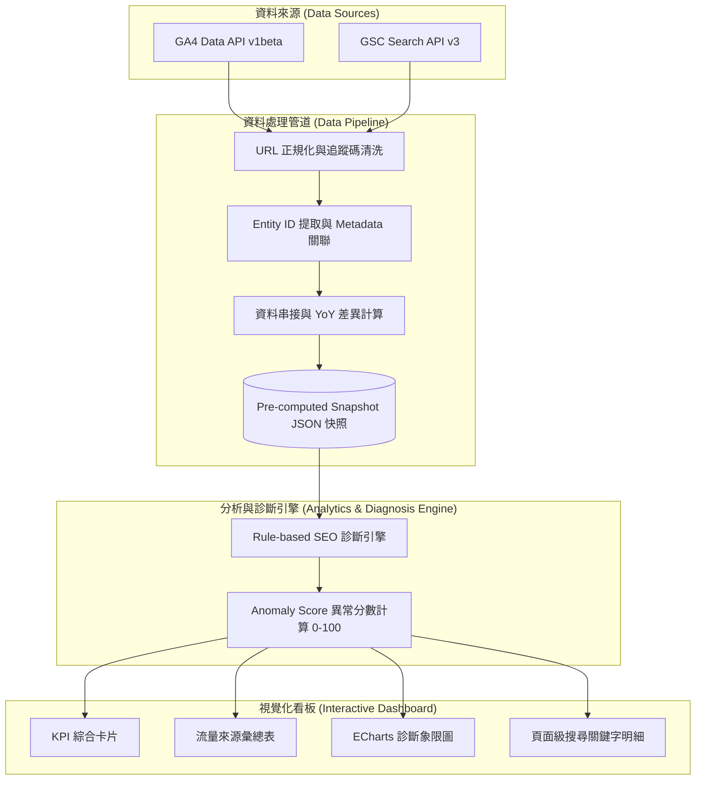

# Web Traffic Quality & SEO Diagnosis Dashboard

> **以 GA4、GSC 數據與 Rule-based 診斷邏輯驅動的 Marketing Analytics 報表系統**
> 
> *本專案為公開作品集版本，重現一套結合 Google Analytics 4 (GA4) 與 Google Search Console (GSC) 數據的行銷分析系統，用以自動識別流量品質問題、SEO 異常與高價值優化機會。*

---

## 📌 作品集說明 (Portfolio Reconstruction Context)

> **中文說明**：本專案為公開作品集版本，重現一套實際工作中使用的 Marketing Analytics / SEO Diagnosis Dashboard。為保護商業機密與隱私，公開版本採用去識別化假數據 (De-identified / Mock Data)，完整保留原本的系統架構、資料處理邏輯、分析方法與視覺化 UI。
> 
> **Internal Usage Context**: The original internal system was built and has been maintained since September 2025. It is used daily by 10+ internal marketing team members and has been incorporated into the team's weekly reporting workflow. This repository contains a de-identified portfolio reconstruction rather than the production system.

---

## 💡 一、為甚麼建立這個專案 (Why I Built This)

### 商業與分析痛點 (Business & Analytical Problem)
在日常數位行銷與 SEO 運營中，分析人員過去需要分別登入兩個獨立平臺導出報表人工交叉比對：
- **Google Analytics 4 (GA4)**：提供造訪後的使用者行為指標（如 Views, Engagement Rate, Avg Session Duration），但缺乏搜尋引擎前段的曝光與關鍵字情境。
- **Google Search Console (GSC)**：提供搜尋前段表現指標（如 Impressions, Clicks, Avg Position, Search Queries），但無法得知點擊進站後的使用者停留與互動品質。

### 資料與運營挑戰 (Key Data & Operational Challenges)
1. **網址參數雜訊 (URL Parameter Noise)**：GA4 記錄帶有廣告追蹤碼（`utm_source`, `gclid`, `fbclid`）的 Landing Page 網址，導致同一頁面流量被拆分成多列。
2. **標準網址不一致 (Canonical Mismatches)**：GSC 記錄索引的標準網址，兩者網址結構不同，無法直接進行 Join 串接。
3. **API 配額與查詢延遲 (API Quota & Query Latency)**：若每次開啟頁面都即時向 Google API 查詢數千網頁，會迅速觸發 Quota 限制並導致數十秒的載入延遲。
4. **人工排查負擔 (Manual Audit Overhead)**：每週流量報表與異常頁面排查高度依賴人工 Excel VLOOKUP，無法第一時間自動發現流量衰退。

### 專案目標 (System Goal)
建立單一看板自動化連結分析流程：
$$\text{流量數據 (Traffic Data)} \longrightarrow \text{搜尋表現 (Search Performance)} \longrightarrow \text{網址正規化 (URL Normalization)} \longrightarrow \text{規則診斷 (Rule-based Diagnosis)}$$

---

## ⚙️ 二、系統核心功能 (What the System Does)



---

## 🌟 三、關鍵能力 (Key Capabilities)

1. **GA4 + GSC 跨平臺整合分析 (Unified Analytics)**：結合 post-click 造訪互動與 pre-click 搜尋表現於單一作業視角。
2. **確定性 URL 正規化 (URL Normalization)**：自動清洗追蹤參數（`utm_*`, `gclid`, `fbclid`），並透過 Regex Pattern Matching 精確綁定 GA4 與 GSC 網址。
3. **Rule-based SEO 異常診斷引擎**：依據 YoY 點擊流失、排名下滑與 CTR 衰退計算 0~100 分的 Anomaly Score，自動標註診斷病徵標籤。
4. **Snapshot 預計算快照策略**：透過背景任務預先計算並儲存 JSON 快照，消除 API 延遲並避免觸發 Google 配額限制。
5. **雙模式互動視覺化 (Dual-Mode Visualization)**：切換 **GA4 流量品質模式** 與 **GSC 自然流量診斷模式**，搭配 ECharts 散佈圖與動態篩選卡片。
6. **頁面級關鍵字鑽取 (Page-level Keyword Breakdown)**：點擊任意頁面即可動態撈取對應的 GSC 搜尋關鍵字與 YoY 差異。
7. **獨立 Mock 預覽模式 (Standalone Demo Mode)**：內建離線 Mock 資料生成器與 Client-side 備援機制，無須 GCP Credentials 即可在 GitHub Pages 上直接預覽。

---

## 📐 四、系統架構 (System Architecture)

### 技術架構流程圖


### 商業問題到技術方案對照圖


---

## 🧹 五、資料處理管道 (Data Processing Pipeline)

### 1. URL 正規化與追蹤碼清洗 (URL Normalization)
在將 GA4 與 GSC 資料串接前，網址需通過規則清洗：
- 強制剝離廣告與行銷追蹤參數：`utm_source`, `utm_medium`, `utm_campaign`, `gclid`, `fbclid`。
- 提取頁面核心識別 ID（例如 `news_id=1001` $\rightarrow$ ID `1001`）。
- 清洗特殊前綴（例如剝離 `edm_` 前綴，將內部鍵值統一）。

### 2. Pattern 比對與 Metadata 整合 (Pattern Matching)
- 對照 `page_map.csv` 元數據，為頁面補全標題、產品類別（Product）與小分類（Product Detail）。
- 動態生成 GSC 正則查詢 Pattern（例如 `(edm_id=|edm[_-]?)(525)([^a-zA-Z0-9]|$)`），穩定比對 GSC 收錄網址。

### 3. Snapshot 快照與快取策略 (Snapshot Caching)
- **背景預計算**：`build_snapshots.py` 預先向 API 抓取各區間（7d, 14d, 28d, 90d, Month, YoY 對照）資料，處理完畢後序列化儲存於 `backend/snapshots/` 資料夾。
- **API 效能優化**：FastAPI 伺服器啟動時直接讀取記憶體快照，搭配 `GZipMiddleware` 進行回應壓縮，大幅提升網頁載入速度。

---

## 🔍 六、Rule-based SEO 診斷邏輯 (SEO Diagnosis Logic)

本系統採用**確定性的 Rule-based 規則邏輯**計算 0~100 分的 Anomaly Score，並自動判定頁面的診斷病徵標籤。

### 扣分因子與權重 (Max 100 Points)
當 YoY 點擊衰退 (`deltaClicks < 0`) 時：
- **點擊流失懲罰 (Click Loss Penalty, Max 50 pts)**: `min(50, abs(deltaClicks) * 0.1)`
- **排名下降懲罰 (Position Drop Penalty, Max 30 pts)**: `min(30, max(0, deltaPosition) * 5)`
- **CTR 衰退懲罰 (CTR Decline Penalty, Max 20 pts)**: `min(20, abs(deltaCTR) * 100 * 2)`
- **高曝光零點擊懲罰 (High Exposure Zero Click Penalty, Max 20 pts)**: `min(20, currentImpressions * 0.01)` (當 Clicks = 0 且 Impressions > 500)

### 診斷標籤與調查建議 (Diagnostic Archetypes & Recommended Investigation)

| 診斷病徵標籤 | 可觀察數據模式 | 建議調查方向 |
| :--- | :--- | :--- |
| **高價值流量流失 (High-Value Traffic Loss)** | 點擊 ↓ (`deltaClicks < 0`) 且 曝光 ↓ (`deltaImpressions < 0`) | 檢查文章內容是否過時、觀察季節性趨勢，或確認主要目標關鍵字搜尋需求是否下降。 |
| **排名衰退 (Ranking Decline)** | 點擊 ↓ (`deltaClicks < 0`) 且 排名退步 > 1 名 | 分析 SERP 競品動態、檢查新竄起競品內容，並優化本頁內容深度。 |
| **CTR衰退 (CTR Decline)** | 點擊 ↓ (`deltaClicks < 0`) 且 CTR 衰退 > 5% | 檢查 Meta Title 與 Description 的 SERP 吸引力，或確認是否有新的 SERP Feature 搶走版面。 |
| **高曝光低 CTR (High Exposure / Low CTR)** | 當期點擊 = 0 且 曝光量 > 1,000 | 評估搜尋意圖符合度，嘗試重寫 Meta 標題以提升點閱誘因。 |
| **搜尋需求下降 (Search Demand Decline)** | 曝光 ↓ > 500 且 點擊 ↓ (`deltaClicks < 0`) | 反映大環境對於該關鍵字議題的搜尋熱度降低，屬市場現象而非技術懲罰。 |
| **快進首頁 (Near Page-One Opportunity)** | 點擊 ↑ (`deltaClicks > 0`) 且 排名 < 10 名 | 識別出正在接近第一頁的潛力頁面，可新增內部連結與更新內容以鞏固排名。 |

---

## 💡 七、重要技術決策 (Important Technical Decisions)

### 為什麼先做 URL 正規化？ (Why URL Normalization First?)
GA4 與 GSC 對網址的記錄方式本質不同。GA4 運作於前端造訪（含 UTM 廣告追蹤參數），而 GSC 運作於搜尋索引的 Canonical URL。直接進行網址比對會產生大量的 Unmapped Data。先洗滌廣告參數並提取核心識別 ID，才能從根本解決資料分裂問題。

### 為什麼採用 Snapshot 快照？ (Why Snapshot-based Caching?)
每次開啟報表都即時發起 API 查詢會面臨數十秒的傳輸延遲與嚴格的 API Quota 限制。透過背景預計算 worker (`build_snapshots.py`) 每 6 小時一次性匯入全站數據並儲存 JSON 快照，大幅降低對 live API 的依賴，達成秒級流暢回應。

---

## 🛠️ 八、使用技術 (Technologies Used)

### 分析與數據 API (Analytics & Data APIs)
- **Google Analytics 4 Data API** (`google-analytics-data`)
- **Google Search Console API** (`google-api-python-client`)

### 後端引擎 (Backend Engine)
- **Python 3.11**
- **FastAPI** & **Uvicorn**
- **Pandas**（資料清洗與矩陣運算）
- **APScheduler**（背景快照自動排程）

### 前端看板 (Frontend Dashboard)
- **HTML5** & **CSS3**
- **Vanilla JavaScript (ES6+)**
- **ECharts v5**（散佈圖與互動圖表）
- **Bootstrap**（網格版面佈局）

---

## 👤 九、作品集定位與貢獻 (Portfolio Context)

### 我的角色與貢獻 (My Role & Contributions)
- **問題定義 (Problem Definition)**：識別人工跨平臺對照 GA4/GSC 報表的運營痛點。
- **資料需求定義 (Data Requirement Definition)**：設計網址清洗規則、 Join Schema 與指標彙總邏輯。
- **分析與診斷邏輯 (Analytics & Diagnostic Logic)**：研發 4 大扣分因子與 6 大 SEO 診斷病徵規則。
- **資料處理實作 (Data Processing Implementation)**：撰寫 Python 腳本處理參數剝離、ID 提取與 Snapshot 排程快取。
- **API 與看板開發 (API & Dashboard Development)**：開發 FastAPI REST API 與 ECharts 視覺化前端看板。

---

## 🚀 十、快速開始與本機 Demo (Quick Start / Local Demo)

您可在本機使用 Mock 資料直接執行本專案，無需設定任何 Google API 憑證：

### 1. 複製專案與安裝套件
```bash
git clone https://github.com/opnew125/traffic-quality-report.git
cd traffic-quality-report
pip install -r requirements.txt
```

### 2. 產生 Mock 資料快照
```bash
python backend/generate_mock_data.py
```

### 3. 啟動 FastAPI 後端伺服器
```bash
python -m uvicorn backend.app:app --host 127.0.0.1 --port 8888
```

### 4. 開啟看板網頁
在瀏覽器開啟：
```
http://127.0.0.1:8888/frontend/
```
使用 Demo 帳號登入：
- **員工編號**：`DEMO001` 或 `DEMO002`

### 線上預覽 (GitHub Pages)
免伺服器直接體驗 Client-side Mock 預覽版本：
🔗 **[https://opnew125.github.io/traffic-quality-report/frontend/](https://opnew125.github.io/traffic-quality-report/frontend/)**

---

## ⚠️ 十一、限制說明 (Limitations)

- **去識別化數據範圍**：本公開儲存庫使用去識別化與模擬數據集 (Mock Data)，以保護商業隱私。
- **確定性規則邏輯**：SEO 診斷引擎採用確定性的 Rule-based 邏輯，而非 Machine Learning 模型。
- **公開作品集範圍**：正式環境的基礎架構（如公司內部網域部署設定）未包含於本公開作品集中。
