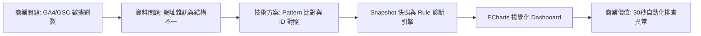

# 系統架構與技術說明 (System Architecture & Technical Specifications)

## 1. 專案總覽 (Project Overview)

**Web Traffic Quality & SEO Diagnosis Dashboard** 是一個旨在解決數位行銷與 SEO 運營痛點的分析系統。過去分析人員需要分別進入 Google Analytics 4 (GA4) 與 Google Search Console (GSC) 導出報表進行人工交叉比對。

本系統透過 URL 正規化、資料關聯 Join 與 Snapshot 快照機制，將跨平臺數據整合至單一看板。並藉由內建的 **Rule-based SEO 診斷引擎**，自動識別高價值優化機會、流量衰退風險與搜尋表現異常。

---

## 2. 技術堆疊 (Technology Stack)

| 領域 | 使用技術 | 說明 |
| :--- | :--- | :--- |
| **數據來源** | GA4 Data API v1beta, Google Search Console API v3 | 流量品質與搜尋表現之核心資料源 |
| **後端框架** | Python 3.11, FastAPI, Uvicorn | 非同步 RESTful API 服務 |
| **資料處理** | Pandas, Regex, Pattern Matching | 資料清洗、聚合、ID 提取與網址正規化 |
| **快取與排程** | APScheduler, GZipMiddleware | 背景每 6 小時自動產生 JSON 快照與壓縮回應 Payload |
| **前端視覺化** | HTML5, CSS3, Vanilla JavaScript (ES6+), ECharts v5 | 互動式看板、診斷散佈圖與多維度篩選 |

---

## 3. 系統架構圖 (Architecture Diagrams)

### 3.1 資料流架構圖 (Data Flow Architecture)

```mermaid
flowchart TD
    subgraph 外部資料來源 (External Data Sources)
        GA4[GA4 Data API v1beta]
        GSC[GSC Search API v3]
    end

    subgraph 後端資料管道 (Backend Pipeline)
        Pull[資料抓取 Worker]
        Clean[URL 正規化與追蹤碼清洗]
        Merge[ID 提取與 Mapping 合併]
        Snap[(快照 Snapshot JSON)]
        API[FastAPI REST API 端點]
        Cache[記憶體快照與回應壓縮]
    end

    subgraph 前端看板 (Frontend Dashboard)
        UI[互動控制面板]
        KPI[KPI 綜合卡片]
        Table[流量來源彙總表]
        Chart[ECharts 診斷象限圖]
    end

    GA4 --> Pull
    GSC --> Pull
    Pull --> Clean
    Clean --> Merge
    Merge --> Snap
    Snap --> API
    API --> Cache
    Cache --> UI
    UI --> KPI
    UI --> Table
    UI --> Chart
```

### 3.2 商業問題到技術方案流程圖 (Problem-to-Solution Workflow)



---

## 4. 後端 API 端點設計 (Backend API Endpoints)

FastAPI 後端提供以下端點以供前端看板調用：

| API 端點 | 查詢參數 (Query Params) | 說明 |
| :--- | :--- | :--- |
| `GET /runReport` (`type=all`) | `k`, `product`, `product_detail` | 讀取快照快取，回傳全站 KPI、流量來源彙總表與圓餅圖數據。 |
| `GET /runReport` (`type=drill`) | `k`, `product`, `product_detail`, `source_group` | 回傳分類頁面明細（新聞、文章、心得、直播、EDM、專題）與診斷警報項目。 |
| `GET /runReport` (`type=gsc_top_queries`) | `k`, `product`, `product_detail` | 查詢熱門搜尋關鍵字及其 YoY 曝光與點擊差異。 |
| `GET /runReport` (`type=page_queries`) | `k`, `category`, `id` | 查詢特定頁面對應的 GSC 搜尋關鍵字。 |
| `GET /runReport` (`type=breakdown`) | `k`, `category`, `id` | 回傳單一頁面的細分流量來源組成。 |

---

## 5. 安全與門禁機制 (Security & Authentication)

> [!NOTE]
> **作品集安全說明**：
> 本專案的門禁驗證採用 LocalStorage Token 檢查與員工編號白名單 (`allowed_emp_ids.txt`)，專為 **本機 Demo 與靜態預覽** 設計，非 Production 安全門禁機制。

- **員工編號白名單**：比對 `allowed_emp_ids.txt` 文字檔（預設 Demo 帳號：`DEMO001`, `DEMO002`）。
- **稽核日誌**：系統請求會自動記錄於 `usage_logs.csv`。
- **純前端 Mock 備援**：當部署於 GitHub Pages 等靜態環境時，前端會自動啟用 Mock Engine 產生數據，確保無須暴露內部 Credentials 即可預覽。
