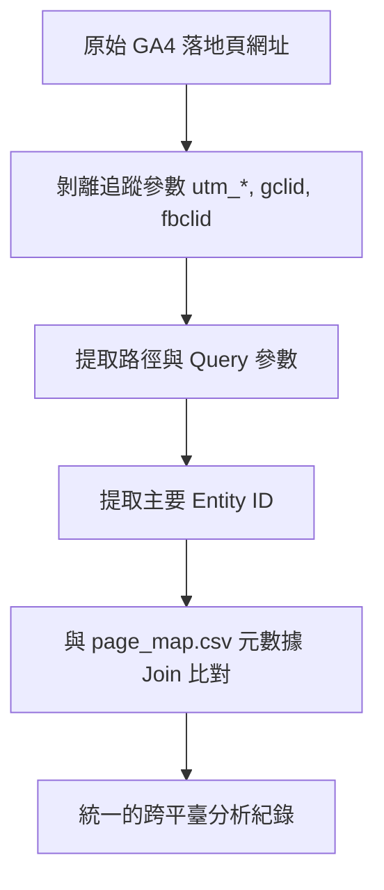

# 資料處理與網址正規化管道 (Data Processing & URL Normalization)

## 1. 資料串接的挑戰 (The Data Matching Challenge)

在數位行銷分析中，整合 Google Analytics 4 (GA4) 與 Google Search Console (GSC) 面臨三大數據整合瓶頸：

1. **網址參數雜訊 (URL Parameter Noise)**：GA4 記錄帶有行銷與廣告追蹤碼（`utm_source`, `gclid`, `fbclid`）的網址，導致同一內容頁面的流量被拆分為數列。
2. **標準網址差異 (Canonical vs. Actual Paths)**：GSC 記錄被 Google 索引的 Canonical URL，與帶有行銷參數的網址無法直接 Join。
3. **命名格式規格不一 (Inconsistent Naming Formats)**：內部活動頁與 EDM 在不同系統中可能帶有不同前綴（例如 GA4 為 `525`，GSC 記錄為 `edm525` 或 `edm_525`）。

---

## 2. 資料清洗與 URL 正規化 (Data Cleaning & URL Normalization)

為確保資料對接正確，系統實作確定性的清洗規則：



### 2.1 追蹤參數剝離 (Parameter Stripping)
資料管道在聚合前會自動剝離以下行銷與廣告參數：
- `utm_source`, `utm_medium`, `utm_campaign`, `utm_content`, `utm_term`
- `gclid` (Google Click Identifier)
- `fbclid` (Facebook Click Identifier)

### 2.2 ID 提取與實體映射 (ID Extraction & Entity Mapping)
對於內容頁面（新聞、文章、心得、直播、EDM、專題），系統透過正則表達式提取核心 ID：
- **一般頁面**：從 `news_id=1001` 或 `article_id=2001` 中提取主鍵 `1001` 與 `2001`。
- **前綴處理 (EDM)**：剝離 `edm_` 或 `edm-` 前綴，將鍵值統一為純數字。
- **元數據映射**：將提取的 ID 與 `page_map.csv` Join，補全頁面標題、產品類別 (`product`) 與小分類 (`product_detail`)。

### 2.3 GSC 查詢的動態 Pattern 比對 (Dynamic Pattern Matching)
為避免因網址微小差異導致比對失敗，系統生成動態正則 Pattern 向 GSC 發起查詢：
- 針對 EDM ID `525`，生成 Pattern `(edm_id=|edm[_-]?)(525)([^a-zA-Z0-9]|$)`，以穩定捕獲 GSC 後台收錄的網址變體。

---

## 3. Snapshot 快照與快取策略 (Snapshot Caching Strategy)

每次開啟報表都即時發起 Google API 查詢會帶來兩大問題：
- **API 配額限制 (Quota Exceeded Limits)**：Google APIs 對每分鐘/每日查詢設有嚴格限制。
- **傳輸延遲 (Query Latency)**：大量頁面與歷史比對數據查詢需耗時 15~30+ 秒。

### 解決方案：預計算快照儲存 (Pre-computed Snapshot Storage)

```
backend/
├── build_snapshots.py      # 背景抓取 API 資料的 Worker 腳本
├── generate_mock_data.py   # 離線 Demo Mock 資料生成器
└── snapshots/              # 預先計算好的快照 JSON 檔案
    ├── l2_drill__28d.json
    ├── l2_drill__month.json
    └── ...
```

1. **預計算 Worker**：`build_snapshots.py` 預先抓取過去月份與每日數據，進行 URL 洗滌與 YoY 比對運算後序列化儲存於 `backend/snapshots/`。
2. **背景排程器**：`APScheduler` 於背景定期（如每 6 小時）更新 Snapshot JSON。
3. **回應壓縮**：FastAPI 伺服器直接載入快照檔案，搭配 `GZipMiddleware` 進行回應壓縮，大幅提升網頁讀取速度。
